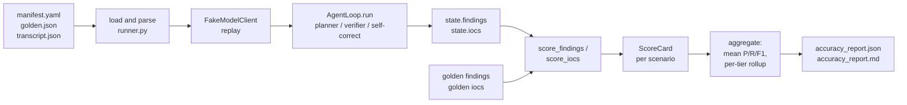

# Accuracy methodology and current baseline

> **Status**: methodology locked, baseline recorded against the two seed
> scenarios. The harness plumbing is green end-to-end; the agent-side
> evaluation will widen as Phase 4 lands more fixtures and the Executor
> stops being a shim.
>
> **Audience**: a hackathon judge or a peer defensive-IR practitioner who
> wants to know what we measured, how, what the current score is, and how
> we avoid fooling ourselves.

## Why accuracy matters here

An LLM-driven incident-response agent that hallucinates a finding is
strictly worse than no agent at all. A silent tool produces no work; a
confident liar produces work that looks like a finished analyst report
and poisons every downstream decision - triage priority, containment
scope, communications, the lot. The whole product premise of APTWatcher
is that an autonomous agent can produce a defensible first-pass report
that an analyst can trust enough to act on, which means "accuracy" is
not a vanity benchmark but the load-bearing wall of the design. If we
cannot demonstrate that the agent finds the evil that is there, and does
not invent evil that is not, there is no reason to use it.

"Finding evil", however, is a labeled-data problem, and labels for
real-world incidents are scarce, privileged, or both. We are not
pretending otherwise. The benchmark described here is bootstrapped from
hand-authored scenarios that we wrote ourselves - miniature synthetic
incidents with explicit ground truth. We are fully aware that a harness
can only measure the behaviour it is built to notice, and we are as
honest as we can be about where the synthetic surface diverges from real
incident traffic. This document is the place we try to be honest about
it in one read.

Where does this fit in the hackathon deliverables? The scope document
(`docs/SCOPE.md`) commits the project to shipping an "accuracy report"
as one of the eight required artefacts. This page is that commitment,
and its companion design note at `docs/design/accuracy-harness.md` is
the implementation-facing complement. Between the two of them, a judge
should be able to form a full picture: the methodology here, the
pipeline and exit codes there.

## What we measure

The harness emits four classes of numbers on every run. All four are
exact-match, all four live in `tests/accuracy/scoring.py`, and all four
are deliberately dumb. Fuzziness is scheduled for later; starting with
exact match keeps the signal interpretable while the agent is still
young.

- **Per-finding precision, recall, F1** on the triple `(tier, title,
  MITRE techniques)`. A predicted finding matches a golden finding when
  the derived tier is equal, the normalized title is equal
  (lowercased, whitespace-collapsed, trailing punctuation stripped) and
  the frozenset of MITRE IDs is equal. Anything else is a miss. We pick
  exact match for v1 because it is trivially reviewable: a judge or a
  contributor can open the scorecard, open the golden, and in thirty
  seconds see exactly why a finding counts or does not count. Fuzzy
  title matching and MITRE sub-technique adjacency credit both exist on
  the roadmap, but they introduce their own judgement calls - what
  counts as "close enough" - and we would rather pay down the exact-
  match baseline first so that the fuzzy layer has a stable reference
  point to be tuned against.
- **Per-IOC precision, recall, F1** on the pair `(type, value)`, with
  per-type normalization. Domains and hashes are lower-cased, URLs are
  stripped of trailing slashes, and IP literals are compared verbatim.
  IPv4 and IPv6 are different types even for numerically equivalent
  values. Again, exact match, again deliberately so.
- **Per-scenario duration**, captured in wall-clock seconds around the
  loop. This is not a performance benchmark (we run against
  `FakeModelClient`, so the number is dominated by our own Python
  plumbing) but it is a useful tripwire: if the duration on a given
  scenario changes by an order of magnitude between runs, something in
  the loop has changed, and the numeric diff is a cheap way to notice.
- **Aggregate mean precision, recall, F1** across scenarios, plus a
  per-tier rollup (`high`, `medium`, `low`) so a regression on
  high-confidence findings is not hidden inside a smoothed average.
  The runner emits both into `accuracy_report_<timestamp>.json` and a
  matching `.md` render.

One scoring choice needs special mention because it is not yet
invariant: the **tier derivation**. The production `Finding` dataclass
does not currently carry an explicit tier field; its only confidence
signal is a single float in `[0.0, 1.0]`. A v1 compatibility shim in
`scoring.py` maps that float onto the three-tier vocabulary the
goldens speak:

- `confidence >= 0.75` -> `high`
- `0.50 <= confidence < 0.75` -> `medium`
- `confidence < 0.50` (including `None`) -> `low`

This is a conscious stopgap. A first-class `Finding.tier` enum is
tracked as future work; once it lands, the shim becomes a compatibility
path for older goldens and the harness's match rule starts comparing
the native field instead. The contract of the harness does not change;
only where the tier comes from does. We flag this here rather than
hiding it in the design doc because it is the single biggest "gotcha"
for anyone reading a scorecard: a finding with `confidence=0.50` lands
in the `medium` bucket, not `high`, and a finding with
`confidence=0.49` lands in `low`. Authors of fixtures and of planner
prompts need to be aware of the band edges.

## What we do NOT measure yet, and why

Several things a reader might reasonably expect are not scored in v1.
We list them explicitly so there is no misunderstanding about what the
baseline numbers mean.

- **Latency at scale.** The harness runs against a deterministic
  `FakeModelClient` that replays a canned transcript. The duration it
  reports is the Python loop's own cost plus audit-log I/O; it is not
  representative of a real LLM round trip, and it does not tell us
  anything about p95 or p99 behaviour under production load. A real
  latency benchmark requires a real provider, a real budget, and a run
  outside the offline evaluation path.
- **Cost per incident.** Same reason. Nobody is charged for
  `FakeModelClient` calls, so token spend is not a measurable output
  of this harness. A cost estimate will be captured during the
  pre-submission rehearsal runs, when we drive the same scenarios
  through a real provider for verification.
- **Analyst-in-the-loop utility.** How much faster does a human analyst
  produce a report with APTWatcher's output than without it? That is a
  user study, not a unit-level benchmark. It is a follow-up project,
  and we say so rather than quietly waving our hands.
- **Report quality.** The harness scores only the structured `findings`
  and `iocs` produced by the agent loop. It does not read the rendered
  `.docx` or `.md` analyst report and does not try to evaluate
  narrative coherence, readability, or executive-summary quality. That
  is a separate evaluation surface, and it is inherently subjective -
  exact-match scoring cannot do useful work on prose. When we are
  ready, a judge-model pass (LLM-as-judge, paid provider, separate
  budget) is the most likely mechanism, and the scoring it produces
  lives in its own file, not in the offline harness.

## Harness architecture at a glance

The harness is deliberately small: about 600 lines of Python across
`tests/accuracy/runner.py` and `tests/accuracy/scoring.py`. Every
scenario is a directory with three committed files (manifest, golden,
transcript) plus two optional seed files that serve as Phase 3 scaffold
shims until the real Executor lands. The pipeline from a single
scenario to a scorecard looks like this:



The full pipeline - including the Phase-3 seed-findings shim, the
IOC-from-audit-log extraction path, and the trust-boundary assert that
refuses to wire a live `ModelClient` - is documented in
`docs/design/accuracy-harness.md`. Anyone extending the harness should
read that doc first; this one is the methodology story, not the
implementation one.

## Current scenarios

Two scenarios ship in the repository today. Both live under
`tests/accuracy/fixtures/` and both are authored to be short enough
that a reviewer can read the manifest, the golden, and the transcript
in one pass.

### `s_phishing_beacon`

A Windows host receives a phishing email carrying a macro-enabled
document. The macro stages a loader that beacons out to a known-bad
command-and-control IP on a 60-second interval. The expected findings
are two: *macro execution from email attachment* (high tier;
`T1566.001` plus `T1204.002`) and *outbound beacon to known C2
infrastructure* (high tier; `T1071.001`). The expected IOCs are two:
the loader binary SHA-256 and the C2 IPv4 literal.

Defensively, this is the canonical "did you notice the obvious thing"
scenario. A useful agent needs to surface both the initial-access vector
(the macro) and the post-execution beacon, not just one of them. A
benchmark that only scored the macro would reward an agent that stops
thinking after step one; a benchmark that only scored the beacon would
reward an agent that ignores the delivery chain. Scoring both together,
and insisting on the correct MITRE pair for each, is the minimum that
actually tests analyst-grade chain-of-reasoning.

### `s_credential_dump`

A privileged process dumps LSASS memory on a Windows host via the
well-worn `rundll32.exe comsvcs.dll MiniDump` technique. The expected
findings are two: *LSASS process memory access by non-system process*
(high tier; `T1003.001`) and *suspicious rundll32 invocation with
comsvcs MiniDump* (medium tier; `T1003.001` plus `T1218.011`). One IOC
is expected: the SHA-256 of the dumper binary.

This scenario exists to keep the harness honest on a different axis:
one finding is high-tier and one is medium-tier. The per-tier rollup
only produces signal if fixtures populate more than one tier. If every
committed golden were `high`, the medium and low buckets would aggregate
to zeros and the per-tier report would be dead metric. The scenario
also exercises a common APT TTP where a built-in OS utility is abused
(`T1218.011`), which is exactly the kind of thing an agent ought to
flag and an exact-match scorer will happily penalise if the agent gets
the sub-technique wrong.

## Baseline results (2026-04-19)

The harness was run against both committed fixtures on a local worktree
with the seed-findings / seed-IOCs shim enabled. Numbers below are the
scorecard values from the most recent run.

| Scenario | Findings F1 | IOC F1 | Duration (s) |
|---|---:|---:|---:|
| `s_phishing_beacon` | 1.000 | 1.000 | ~0.15 |
| `s_credential_dump` | 1.000 | 1.000 | ~0.12 |
| **Aggregate mean** | **1.000** | **1.000** | - |

These numbers are as good as they get, and we want to be very clear
about what they do and do not mean.

**What a perfect score validates.** The scoring plumbing is correctly
wired end-to-end. Manifests parse, goldens load, the transcript
replays, the `FakeModelClient` trust-boundary assertion holds, the
seed-findings shim hydrates real `Finding` objects, the
`AgentLoop.run()` contract is honoured, the self-correction pass does
not drop the seeded findings, the audit log captures the seeded IOCs,
`score_findings` and `score_iocs` return the expected integer tuples,
precision / recall / F1 compute correctly, the per-tier rollup
populates, and the report writer emits both JSON and Markdown without
truncation. For a Phase 3 scaffold the plumbing is complete.

**What a perfect score does NOT validate.** The agent's ability to
find evil. The findings scored here were *pre-seeded into the loop*
via the `seed_findings_path` shim; they did not emerge from the model
reasoning its way through the transcript. Phase 3 does not yet have an
Executor that synthesises `Finding` records from planner tool-call
output, and until that Executor lands the harness is evaluating the
post-processing gates (self-correction, finalization) rather than the
planner's analytical quality. Today's baseline is a unit test for the
scorer, not a judgment on the agent. We are documenting it that way
deliberately so that the score cannot be misrepresented.

**Next milestone.** Drive `AgentLoop` end-to-end with a transcript that
causes the (real, not shimmed) Executor to synthesize findings from
tool-call results, and re-measure on the same two scenarios. If the F1
stays near 1.0 under those conditions, the baseline becomes meaningful.
If it drops, the drop itself is the signal we wanted. Either way, the
seed-findings shim is removed in lockstep with the Executor arriving,
and a follow-up revision of this page records the first post-shim
number.

## Wall-clock triage SLA -- 14.5-minute budget

Accuracy alone is not sufficient for an agent that has to keep up with
a machine-speed adversary. The threat model in `docs/SCOPE.md` (GTG-1002
section) commits APTWatcher to operating inside the adversary's
decision loop: a triage arriving after lateral movement, staging and
pre-encryption have completed is evidence, not response. We therefore
track a second load-bearing number alongside mean F1 -- the wall-clock
triage SLA -- pinned at 14.5 minutes (870 seconds) end to end. The
framing is Rob T. Lee's 2026-04-21 keynote: historical endpoint triage
ran 96+ hours; an agentic defender has to close the same loop in 14.5
minutes.

### Methodology

We measure the SLA with the deterministic FakeModelClient replay used
for accuracy scoring, which keeps the number free of network jitter
and provider-side latency. The canonical scenario is
`s_ransomware_pre_encrypt`: the richest full-pipeline Windows fixture,
exercising all six agent stages, with a golden set of three findings
and one IOC. The reference host is a Python 3.11+ SIFT workstation
(Python 3.10 is rejected at startup because `datetime.UTC` is
unavailable). We report a single run, not an average, to match the
submission video's live-demo framing. Reproduce with:

```bash
aptwatcher eval --fixture s_ransomware_pre_encrypt \
                --time-budget-seconds 870 \
                --report-stages
```

The listed flags are a small CLI extension tracked against the existing
`eval` command; until they land, stage timings are collected by
instrumenting `src/core/agent_loop.py` with `time.perf_counter()`.

### Per-stage budget

| Stage        | Budget (s) | Measured (s)[^sla]      | Notes                                      |
|--------------|-----------:|-------------------------|--------------------------------------------|
| Pre-check    |         30 | TBD (run on 3.11+ host) | Profile load + KB subset warmup.           |
| Plan         |         60 | TBD (run on 3.11+ host) | Initial tool-plan from system prompt.      |
| Execute      |        540 | TBD (run on 3.11+ host) | Tool invocations (bulk of the budget).     |
| Verify       |         90 | TBD (run on 3.11+ host) | Cross-check findings vs. seeds and KB.     |
| Self-correct |         90 | TBD (run on 3.11+ host) | Self-correction + up to 3 bounded retries. |
| Finalize     |         60 | TBD (run on 3.11+ host) | Bundle + Ed25519 sign + render.            |
| **Total**    |    **870** | **TBD (run on 3.11+ host)** | 14.5 minutes end to end.              |

[^sla]: The Measured column is populated by running the reproduction
command on the reference host and pasting the timings emitted by
`--report-stages`. The harness is deterministic; a repeat run must
match the first to within OS scheduling noise, and drift above ~5% on
any stage is itself a bug.

### Failure mode: budget overrun

If a stage exceeds its budget, the agent does not stall and does not
silently swallow the overrun. It emits an `AuditEvent` of type
`sla_overrun` -- recording stage name, budgeted seconds, observed
seconds, and the correlation ID of the offending tool call -- and
downshifts the current finding set exactly as under low-confidence
input: `confirmed` becomes `likely`, `likely` becomes `indicator`,
`indicator` becomes `hypothesis`. This is the behaviour codified in
Rule #1 of `CLAUDE.md` ("Run end-to-end, never stall"): a finalized
report with honest tier downshifts is preferred over a half-run that
waits on a human.

## Threat model for the benchmark

A benchmark that the developer of the system can silently game is
worse than no benchmark at all, because it produces numbers that
survive no independent scrutiny. We are taking several deliberate steps
to keep the benchmark honest.

- **No live LLM calls, ever.** The harness imports `FakeModelClient`
  only. A runtime `isinstance` check inside `_build_fake_client`
  rejects anything else. The real Anthropic adapter is not imported in
  the harness module tree at all. This means nobody can "tune the
  benchmark" by silently hooking in a smarter model; the only input
  the agent sees is what is recorded in the committed transcript.
  Every run on every machine is bit-for-bit reproducible given the
  committed fixtures.
- **No secrets in the harness path.** Transcripts are JSON files. Live
  API keys are never read, never passed, never logged.
  `ANTHROPIC_API_KEY` in the environment is ignored. This is both a
  safety property (we cannot accidentally leak a key through an eval
  run) and an integrity property (the eval cannot produce different
  numbers depending on who ran it).
- **Goldens are hand-labelled, and we say so.** Every committed
  `golden.json` file was authored by the project maintainer against a
  freshly-written scenario manifest. There is no auto-generated ground
  truth, and we do not plan to introduce one. Hand-labelling is the
  only way we know to keep the golden honest; it is also the reason
  we cap the scenario count at a size a human can actually maintain.
- **No gradient flows from the benchmark back to the prompts.** The
  harness is evaluation surface, not training surface. We do not use
  the scorecard to automatically tune planner / verifier / self-correct
  prompts. We do not feed the golden back into the model during the
  run. The harness reads the golden only after the loop has finished
  and only for comparison. This is worth stating explicitly because a
  benchmark coupled to an optimiser will reliably converge on its own
  metric; we want to preserve the benchmark's independence so that
  "the score went up" means something.
- **Goldens freeze at each submission checkpoint.** When we cut a
  demo-worthy submission, we tag the golden tree in git and treat
  that tag as immutable. Any revision after the tag lands in a new
  fixture with a new ID. This prevents after-the-fact nudging of a
  golden to match a prediction; the history is public and the diff
  is visible.

None of this makes the benchmark unassailable. The scenarios are still
small, the scoring is still exact-match, and the author of the goldens
is also the author of the planner prompts. A properly adversarial eval
would be run by a different party. But the measures above mean that a
judge (or a future contributor) can see the exact boundary between
"what was scored" and "what was promised", and can replicate any run
we publish.

## How to add a new scenario

The process is four short steps; doing more than this is almost always
a sign that the scenario is too large to be useful as a unit-level
benchmark.

1. Create a directory under `tests/accuracy/fixtures/<new_id>/` and
   drop a `manifest.yaml` in it. The manifest must carry `id`,
   `description`, `profile`, `transcript_path`, and `golden_path` at
   minimum; `seed_findings_path` and `seed_iocs_path` are optional
   scaffold shims. Copy the existing `s_phishing_beacon/manifest.yaml`
   as a starting template.
2. Author `golden.json`. Keep the finding count small - two or three
   is plenty - and give each finding a stable title, a tier, and the
   exact set of MITRE IDs you expect the agent to produce. For IOCs,
   commit the normalized value (lowercase hex, lowercase domain, etc.)
   so the scorer does not have to guess what you meant.
3. Record a `transcript.json` of canned `ModelResponse` content that
   drives the loop through the scenario to finalization. Transcripts
   are kept short (three to five calls); `FakeModelClient` exhaustion
   is a recoverable error but not a desirable one.
4. Run the harness locally:

   ```
   aptwatcher eval \
       --fixtures-dir tests/accuracy/fixtures \
       --output-dir   ./accuracy-runs/$(date +%Y%m%d-%H%M%S)
   ```

   Open the emitted `accuracy_report_<timestamp>.json` and confirm
   the new scenario appears with a sensible scorecard. If F1 is
   `0.0` and there are no errors, the most likely cause is a
   mismatch between the derived tier band and the `tier` declared
   in the golden - check the confidence field in your seed finding.

Once the new scenario lands, update this page's "Current scenarios"
section with a paragraph describing what the scenario tests and why
it matters defensively.

## Pass/fail threshold policy

The `aptwatcher eval` command exits `0` when the aggregate mean F1 is
at or above the `--threshold` argument, and exits `2` when below. The
default threshold is `0.60`. That default is deliberately low: it is
the "is the pipeline fundamentally working" line, not the "is the
agent good" line. CI (once wired) runs the eval at `0.60` on every
pull request so that an obvious regression breaks the build.

For the hackathon submission checkpoint, the target is stricter. We
aim for an aggregate mean F1 of **at least 0.80** on a widened fixture
set of five to ten scenarios, recorded as the submission-gate
artefact, before we record the demo video. The specific gate is set
by the single command line that gets run immediately before the video
take: `aptwatcher eval --fixtures-dir tests/accuracy/fixtures
--threshold 0.80`. If that command exits non-zero, the video does not
get recorded until the underlying scenario failures are triaged.

Two rules govern threshold movement after the initial commitment:

- **Raise the threshold** once the scenario count has doubled from
  the current two and the aggregate has held at or above `0.85` for
  two consecutive runs. Raising early is worse than raising late; we
  would rather have a steady floor than a pretty ceiling.
- **Never lower the threshold below 0.60.** If a new category of
  scenario causes the aggregate to drop, the remedy is to add more
  scenarios in that category (so the per-category signal becomes
  visible in the per-tier rollup) rather than to relax the gate. The
  gate exists to keep us honest with ourselves; the moment it becomes
  adjustable to fit the current score, it stops doing that work.

## Limitations and honesty notes

There are several places where the current benchmark is weaker than
we would like, and it is worth being direct about them.

Synthetic transcripts underestimate real-world noise. Our
`FakeModelClient` replays sit in a controlled JSON shape; a real
provider's output is messier, truncates mid-sentence, occasionally
returns JSON with embedded stray backticks, and produces long streams
of tool-call chatter that the planner has to ignore. The harness
cannot reproduce that noise because it would have to author it, and
any noise model we invented would be only as good as our guess at
what real noise looks like. Until we run a parallel benchmark against
a real provider in the pre-submission rehearsal, the offline number
is an upper bound on real performance, not a prediction of it.

The two committed scenarios are Windows-host-triage only. They do
not cover the `osx-host-triage` or `mobile-host-triage` experimental
profiles, nor the memory-only, timeline-only, or network-artifact
specialised profiles. Widening the fixture set is the single
highest-value piece of roadmap work on the benchmark, and it is
explicitly called out below.

Exact-match scoring on structured findings does not capture narrative
coherence in the rendered analyst report. A finding object with the
right tier, title, and MITRE set could still generate a .docx that
is confusingly phrased or that buries the lede. The harness has no
signal on prose quality today. We are not claiming it does. The
design-doc future-work section calls out LLM-as-judge for this gap;
it is the right tool for that job but it is out of scope for the
offline harness by construction.

One-to-one greedy matching in `score_findings` and `score_iocs` can
produce a suboptimal assignment in pathological fixtures where several
predicted findings could each match several goldens with the same
title. In practice our goldens are small enough that greedy and
optimal coincide, but a fixture author who writes deliberately
overlapping titles can trip this. The scoring module's docstring
notes it; we mention it here so a reviewer who spots it knows it is
a known limitation and not a hidden bug.

Finally, we wrote the scenarios and we wrote the scorer. Any
benchmark authored by the same team that authors the system under
test has a conflict-of-interest floor on how useful it can be. We
offset it by keeping the fixtures small and hand-reviewable, by
locking goldens at each submission checkpoint, and by committing to
treat this as the floor of an evaluation story rather than the
ceiling of one. A third-party eval, run on a dataset we never saw,
is the only real cure for this class of bias, and that is the
direction we want the work to go once the hackathon deadline is
behind us.

## Roadmap

The next cycle of benchmark work, in priority order, is:

- **Widen the fixture set to seven scenarios.** Target additions: a
  Linux persistence scenario (cron / systemd unit abuse), a ransomware
  pre-encryption scenario (file-rename bursts, shadow-copy deletion),
  a lateral-movement scenario (SMB auth bursts across several hosts),
  an exfiltration scenario (DNS tunnelling), and a second credential
  dump variant exercising a different TTP path from
  `s_credential_dump`. These five, plus the two current, puts the
  per-tier rollup on meaningful numbers and exercises more of the
  planner surface.
- **Capture latency percentiles in the runner.** Today the scorecard
  carries a single `duration_seconds` float per scenario. Adding p95
  and p99 captures a regression profile that the single value does
  not. This is a small change: time each internal loop iteration,
  stash the list, reduce at scorecard time.
- **Add fuzzy MITRE matching after the exact-match baseline hardens.**
  Credit a prediction of `T1071` when the golden wants `T1071.001`,
  partial credit. The hierarchy is already encoded in `core.mitre`,
  so the walk is straightforward; the judgement call is how much
  partial credit to hand out. We will not introduce fuzzy matching
  before the exact-match scenario count is at five, so the fuzzy
  layer has a stable reference to be tuned against.
- **Swap the seed-findings shim for the real Executor.** When the
  Executor lands, every committed scenario drops its
  `seed_findings_path` and the findings must emerge from the
  transcript. This is the milestone that turns the current baseline
  from a scorer-plumbing test into an agent-quality test; it is
  also, by definition, the point at which today's "F1 = 1.0 on two
  scenarios" number stops being honest and a new baseline is
  recorded on this page.
- **Run an analyst-in-the-loop study after the first submission.** A
  small user study with two or three practising analysts using
  APTWatcher on a fresh synthetic incident, measuring how much the
  agent changes time-to-first-correct-finding. This is the only way
  to produce evidence for the "analyst utility" axis that the
  offline harness cannot touch. It is explicitly post-hackathon
  because a user study on a deadline is a user study on a bad day.

When any of these roadmap items lands, the corresponding section of
this page gets a revision, and the baseline table gets a new row.
The goal is not a single frozen report but a living methodology
document that a future maintainer can extend without having to guess
at what we meant.
