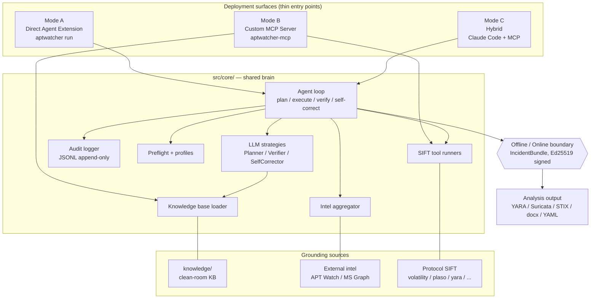

# APTWatcher — Architecture

APTWatcher is an autonomous defensive incident-response agent that runs on the
Protocol SIFT forensic workstation. It triages host evidence, correlates
observables against threat intelligence, self-corrects its own reasoning, and
emits a signed, machine-actionable incident bundle — without hallucinating its
way past the evidence in front of it. This document is the entry point for
contributors and for judges: it describes the shared brain, the three
deployment surfaces that wrap it, the capability tiers that gate optional
behavior, and the architectural guardrails (audit log, self-correction,
evidence integrity) that keep the agent honest.

## System diagram



The diagram collapses to one invariant: every surface imports `core`; `core`
talks to the three grounding sources; the audit logger sees every step; the
offline brain produces a portable bundle that an online peer consumes.

## Deployment modes

APTWatcher ships as three deployment modes that share a single codebase
(`src/core/`). The surface is an operator choice driven by host trust, client
availability, and guardrail preference.

### Mode A — Direct Agent Extension

Claude Code, OpenClaw, or a headless CLI imports `core` directly and drives
the full agent loop locally. Prompt-based guardrails with typed argparse
interfaces. Fastest install, highest operator flexibility, widest tool
reach (shell plus typed wrappers).

- Entry points: `src/agent_extension/cli.py` (`aptwatcher run`, `aptwatcher
  preflight`, `aptwatcher knowledge-search`), `deploy/claude-code/CLAUDE.md`
- See: [`deploy/claude-code/README.md`](https://github.com/aptwatcher/APTWatcher/tree/main/deploy/claude-code)
  and [design/deployment-modes.md](design/deployment-modes.md)

### Mode B — Custom MCP Server

A standalone MCP server (`aptwatcher-mcp`) exposes typed Tier 0 tools
(preflight, knowledge search, volatility, plaso, bulk_extractor, SIFT
update) over stdio. Any MCP-capable client (Claude Desktop, Claude Code,
Cursor, Continue, custom runtimes) can consume them. Mode B does not own
LLM orchestration — the calling client drives the loop.

- Entry points: `src/mcp_server/server.py`, `aptwatcher-mcp` console script
- See: [`deploy/mcp-server/README.md`](https://github.com/aptwatcher/APTWatcher/tree/main/deploy/mcp-server),
  [architecture/mode-b-llm-ownership.md](architecture/mode-b-llm-ownership.md)
  and [design/deployment-modes.md](design/deployment-modes.md)

### Mode C — Hybrid

Mode A drives the loop; Mode B supplies a subset of the tool surface (the
pieces where a structural guardrail beats prompt engineering). This is the
mode recommended for demos, judges, and production. One audit trail, two
layers of defense.

- Entry points: `aptwatcher run` plus `claude mcp add aptwatcher stdio
  aptwatcher-mcp`
- See: [`deploy/hybrid/README.md`](https://github.com/aptwatcher/APTWatcher/tree/main/deploy/hybrid)
  and [design/deployment-modes.md](design/deployment-modes.md)

## Shared core library (`src/core/`)

The brain. Every deployment surface is a thin wrapper that imports from
`core`; no surface owns business logic. Key modules:

| Module | Responsibility |
|---|---|
| `types` | `Finding`, `IOCVerdict`, `HostEvidence`, `PreflightReport`, tier enum, verdict and spoliation enums, `utcnow`. |
| `audit` | Append-only JSONL logger, correlation-ID stamping, redaction, fsync on every write. |
| `config` | Typed `APTWatcherConfig`, per-profile and per-tier toggles, env-var sourcing. |
| `knowledge` | Loads and validates `knowledge/*.md` front-matter, exposes search over the clean-room KB. |
| `preflight` | Probes SIFT tool inventory, builds evidence manifest, refuses to run if a critical tool is missing. |
| `profiles` | Use-case profiles (`windows-host-triage`, `linux-host-triage`, `memory-only`, `timeline-only`, `network-artifact`, two experimental). |
| `agent_loop` | `AgentLoop`, `AgentState`, plan / execute / verify / self-correct orchestration, `ReportEmitError` gate. |
| `llm` | `ModelClient` Protocol, `FakeModelClient` for tests, prompt loader. |
| `llm_anthropic` | `AnthropicModelClient` — real backend, typed errors, retry/backoff. |
| `sift` | Typed runners for volatility3, plaso (log2timeline + psort), bulk_extractor, SIFT update. Allow-lists and arg validation per tool. |
| `strategies` | `LLMPlanner`, `LLMVerifier`, `LLMSelfCorrector` with defensive parsing and safe-default fallbacks. |
| `intel` | `IOCProvider` Protocol, stub provider, HTTP provider base, `IOCAggregator` for multi-source verdicts. |
| `integrations` | GLPI ticket resolvers (stub and MCP subprocess), shape for future platform adapters. |

> Invariant: if code needs to know which deployment mode invoked it, it
> belongs in the surface, not in `core`. The brain is mode-agnostic.

## Capability tiers

| Tier | Name | Default | Notes |
|---|---|---|---|
| 0 | Core forensic triage | enabled | Protocol SIFT + `knowledge/` grounding |
| 1 | External threat intel | opt-in | APT Watch API + MS Threat Analytics MCP |
| 2 | IR workflow integration | opt-in | GLPI MCP (tickets, KB) |
| 3 | Defensive containment | opt-in | cnc_disruptor: pipe kill, local RST only |
| 4 | Offensive containment | gated | cnc_disruptor: adversary infrastructure |

Tiers are gated at the configuration layer: `APTWatcherConfig.tier_enabled`
is checked inside each surface before a tier's tools are even advertised.
No prompt can coax the agent into a disabled tier because the tool does not
exist in its available surface. Tier 4 requires a second explicit flag on
top of tier enablement. Gating details, including the per-tier contracts
and the flag escalation ladder, are captured in `design/tier-gating.md`
(Phase 2 — planned).

- **Tier 0** ships the agent loop, preflight, the clean-room KB, and the
  SIFT wrappers. Active by default on every install. Sufficient for the
  hackathon MVP demo.
- **Tier 1** activates `check_ioc`, `extract_iocs`, and
  `correlate_host_against_intel` when provider credentials are present.
  Missing keys degrade gracefully — the tier runs with whatever subset is
  configured, never errors on absence.
- **Tier 2** wires the GLPI MCP for read-side ticket resolution and a
  future write-side (followup, solution, ticket create — HTML output
  only, never Markdown).
- **Tier 3** enables local containment primitives (process kill, local
  RST, DNS sinkhole) behind `--enable-containment`. Every action logs
  pre/post hashes.
- **Tier 4** allows the cnc_disruptor adversary-infrastructure surface.
  Firewalled behind a separate `--enable-offensive` flag plus a runtime
  warning. Never enabled by default under any profile.

## Three grounding sources

Everything the agent claims is anchored to one of three sources the
audit log can trace back to bytes on disk.

**`knowledge/` — the clean-room knowledge base.** Every entry declares a
`source_type` from a closed set (`author-original`, `llm-synthesis`,
`mitre-attack`, `nist`, `public-blog-summary`, `dfir-report-cc`). Entries
are versioned, citation-attributed, and scanned for forbidden content in
CI. The policy is documented in `knowledge/README.md`; proprietary
material in `~/Dev/docs` is explicitly out of scope.

**External threat intel.** Tier 1 providers (APT Watch, MS Threat
Analytics, future adapters) fan out through a common `IOCAggregator`
that returns a normalized `IOCVerdict`. The orchestration pattern is
adapted clean-room from APT Watch's `validate.py` — per-provider rate
limits, graceful degradation, transaction logging. See
[design/tier1-intel-lookup-pattern.md](design/tier1-intel-lookup-pattern.md).

**Protocol SIFT tools.** volatility3, log2timeline/psort, bulk_extractor,
sleuthkit, YARA, and the SIFT update surface are wrapped by typed
runners with per-tool allow-lists, version probes, and refusal-on-missing
semantics. Preflight pins the tool inventory in the audit log before the
first tool call — no preflight, no authority. See
[design/tier0-sift-lifecycle.md](design/tier0-sift-lifecycle.md).

## Agent loop

```mermaid
sequenceDiagram
    participant Op as Operator
    participant Loop as AgentLoop
    participant Plan as LLMPlanner
    participant Exec as Tool runner
    participant Ver as LLMVerifier
    participant SC as LLMSelfCorrector
    participant Log as AuditLogger

    Op->>Loop: task + profile
    Loop->>Log: preflight event
    Loop->>Plan: plan(state, kb_context)
    Plan-->>Loop: PlanStep[]
    loop per step
        Loop->>Exec: run(tool, args)
        Exec-->>Loop: ToolRunResult
        Loop->>Log: tool_call start/end
        Loop->>Ver: verify(step, result)
        Ver-->>Loop: issues[]
    end
    Loop->>SC: self_correct(findings, audit)
    SC-->>Loop: decision + rewrites
    Loop->>Log: self_correction event
    Loop->>Op: report (gated on self-correction)
```

The loop runs four phases — plan, execute, verify, self-correct — with the
LLM-backed strategies (`LLMPlanner`, `LLMVerifier`, `LLMSelfCorrector`)
swappable against the `ModelClient` Protocol. Each strategy has a
safe-default fallback: the planner falls back to a profile-default plan,
the verifier emits a baseline rule, the self-corrector preserves the draft
unchanged rather than blindly editing it. The report emitter is
architecturally gated on a `self_correction` event — no prompt can bypass
the gate. Details in
[architecture/self-correction.md](architecture/self-correction.md).

## Audit path

Every run writes a JSONL audit log at `logs/<incident_id>/audit.jsonl`,
opened append-only and fsync'd on each write. Four event categories:
`preflight` (tool inventory and evidence manifest), `tool_call` with
start/end correlation-ID pairs (`call-NNNN`), `finding` (citation-linked
claims), `containment_action` (pre/post hashes plus operator
confirmation). Consent events — the operator confirming a SIFT update, a
containment, a Tier 4 action — carry their own entries. The final
`report_emit` step is gated on a valid `self_correction` event belonging
to the current incident. See
[architecture/audit-logging.md](architecture/audit-logging.md); the
full event schema catalog lands in `design/audit-log-format.md`
(Phase 2 — planned).

## Evidence integrity

Read-only is the default for every tool; a tool that might mutate
evidence must declare a `spoliation_risk` and is disabled unless an
explicit flag is set. State-changing operations record a
`pre_state_hash` before and a `post_state_hash` after, plus the
operator's confirmation payload. The agent refuses to overwrite any
existing file under `logs/`, `evidence/`, or the output artifact
directory — every run gets a fresh correlation ID and its own subtree.
See [architecture/evidence-integrity.md](architecture/evidence-integrity.md);
a deeper spec with the full hash-chain contract lands in
`design/evidence-integrity.md` (Phase 2 — planned).

## Offline to online handoff (differentiator)

Real defensive IR is a two-phase workflow. APTWatcher supports both halves
in one product. Phase 1 runs on the air-gapped Protocol SIFT VM: the
offline agent executes Tier 0 wrappers against disk images, memory dumps,
pcaps, and log collections. It produces normalized findings with audit
citations, extracted IOCs, generated YARA rules for the observed TTPs, and
a recommended remediation playbook.

The handoff artifact is an `IncidentBundle` — a versioned pydantic payload
(`schema_version`, `incident_id`, `findings`, `iocs`, `yara_rules`,
`hashes`, `remediation_playbook`, `evidence_manifest`) serialized to
canonical JSON and signed with a detached Ed25519 signature. Operator
manages keys out-of-band. Transport is deliberately pluggable:
USB-sneakernet, signed file drop, git commit, GLPI attachment, Slack DM.
The bundle is the contract; the wire is the operator's choice.

Phase 2 runs online. The same agent binary — or a peer instance on a
management host — ingests the bundle, verifies signature and freshness,
then fans out to direct host actions (kill, quarantine, hash-block,
sinkhole), EDR/XDR push adapters (Defender XDR custom detections,
CrowdStrike IOC API, SentinelOne threat intel), and proxy/DNS block
sinks (Zscaler, Umbrella, internal lists). Every online action follows
the Tier 1 adapter pattern with its own enable flag. Full threat model
and schema land in `design/offline-to-online-handoff.md`
(Phase 3.7 — planned).

## Analysis output pipeline

The offline agent emits artifacts in shapes already produced by the APT
Watch pipeline, so APTWatcher output is drop-in compatible with the
aptwatch.org community feed, MISP, Netcraft v3, and downstream EDR/XDR
platforms. The output set per incident: YARA rules with full meta blocks
(author, date, source, actor, MITRE IDs, severity, hash algorithm,
reference) and provenance-commented strings; per-campaign Suricata rules
with banner headers, classtype, and managed SID ranges; a STIX 2.1 bundle
covering indicators, campaigns, and sightings; a bilingual EN+FR campaign
`.docx` report with identical sectioning in both languages; an analyst
markdown narrative (Context, Hypothesis, IOCs tested, findings, MITRE
references); a community IOC submission YAML matching
`aptwatch/community/TEMPLATE.yaml`; and a `generation_report.json`
manifest with per-file counts, SID range, and skip reasons.

The submission YAML closes the feedback loop. When the operator consents,
APTWatcher publishes the new IOCs back to aptwatch.org, turning every
triage into a contribution to the shared intel corpus — the agent becomes
a participant in the defender community, not just a consumer. Full
generator architecture, SID management, and publication-adapter contracts
land in `design/analysis-output-pipeline.md` (Phase 3.8 — planned).

## Design-note index

| Document | Purpose |
|---|---|
| [design/deployment-modes.md](design/deployment-modes.md) | Three deployment modes, shared brain, mode-specific trade-offs. |
| [design/tier0-sift-lifecycle.md](design/tier0-sift-lifecycle.md) | Preflight, use-case profiles, SIFT update consent, audit contract. |
| [design/tier1-intel-lookup-pattern.md](design/tier1-intel-lookup-pattern.md) | Multi-source intel orchestration adapted from APT Watch. |
| [architecture/audit-logging.md](architecture/audit-logging.md) | JSONL audit log, correlation IDs, redaction, retention. |
| [architecture/self-correction.md](architecture/self-correction.md) | Three self-correction rules and the architectural report gate. |
| [architecture/mode-b-llm-ownership.md](architecture/mode-b-llm-ownership.md) | Why Mode B does not own LLM orchestration. |
| [architecture/evidence-integrity.md](architecture/evidence-integrity.md) | Read-only default, pre/post hash chain, refuse-to-overwrite. |
| [architecture/shared-brain.md](architecture/shared-brain.md) | `src/core/` contracts shared across all surfaces. |
| [architecture/tier-model.md](architecture/tier-model.md) | Tier 0-4 architectural gating and flag escalation. |
| `design/tier-gating.md` | Per-tier contracts, enable flags, runtime warnings (Phase 2 — planned). |
| `design/evidence-integrity.md` | Hash chain, spoliation risks, refuse-to-overwrite contract (Phase 2 — planned). |
| `design/audit-log-format.md` | Event schemas, correlation-ID allocation, consent payloads (Phase 2 — planned). |
| `design/self-correction-gates.md` | Pre-emit checks, rule-level failure modes, metrics (Phase 2 — planned). |
| `design/mcp-tool-schemas.md` | MCP tool JSON schemas, parser contracts, summarization rules (Phase 2 — planned). |
| `design/offline-to-online-handoff.md` | `IncidentBundle` schema, signing, transport, online fan-out (Phase 3.7 — planned). |
| `design/analysis-output-pipeline.md` | YARA/Suricata/STIX/docx/YAML generators and publication adapters (Phase 3.8 — planned). |

## Cross-reference

- [reference/mcp-tools.md](reference/mcp-tools.md) — MCP tool inventory
  with input/output schemas.
- [reference/sift-tools.md](reference/sift-tools.md) — Protocol SIFT
  tool coverage and wrapper status.
- [reference/mitre-coverage.md](reference/mitre-coverage.md) — ATT&CK
  technique coverage matrix.
- [reference/knowledge-index.md](reference/knowledge-index.md) — KB
  entry catalog with `source_type` attribution.
- [use-cases/README.md](use-cases/README.md) — Use-case profile catalog.
- [scenarios/README.md](scenarios/README.md) — Synthetic incident
  scenarios (S01-S03) and rubrics.
- [datasets/README.md](datasets/README.md) — Synthetic and public
  dataset documentation.
- [integrations/README.md](integrations/README.md) — APT Watch, MS
  Threat Analytics, GLPI, cnc_disruptor adapter pages.
